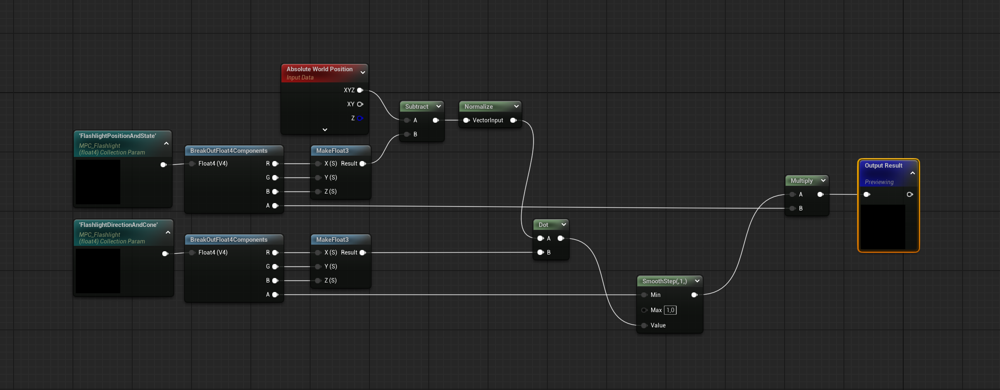

# UE5 Global MPC Flashlight System

A lightweight, Blueprint implementation of a Flashlight system for Unreal Engine 5. Unlike standard SpotLights, this actor pushes its state (Position, Direction, Cone Angle) to a **Material Parameter Collection (MPC)** every frame. 

This enables global shader interactions, such as:
*   **Revealing hidden objects** inside the light cone (World Position Offset / Opacity Mask).
*   Creating custom **fake lighting** effects on unlit materials.
*   Driving gameplay mechanics based on light exposure.

## 🚀 Features

*   **C++ Powered:** Core logic runs in C++ for minimal overhead compared to Blueprints.
*   **GPU Optimization:** Pre-calculates the **Cosine of the Cone Angle** on the CPU to avoid expensive trigonometric functions (`acos`/`degrees`) per-pixel in the shader.
*   **Tick Management:** Stops updating the MPC when the flashlight is turned off to save performance.
*   **Vector Packing:** Efficiently packs data into `FLinearColor` vectors to minimize MPC parameter count.
    *   `Parameter 1`: Position (XYZ) + Active State (W)
    *   `Parameter 2`: Direction (XYZ) + Cone Cosine (W)


**Logic:**
```hlsl
// HLSL Pseudo-code equivalent
float3 ToPixel = normalize(PixelWorldPosition - LightPosition);
float DotResult = dot(ToPixel, LightDirection);

// If DotResult is greater than ConeCosine, the pixel is inside the cone.
float IsInsideCone = step(ConeCosine, DotResult);
```


## Material Setup




## DEMO


